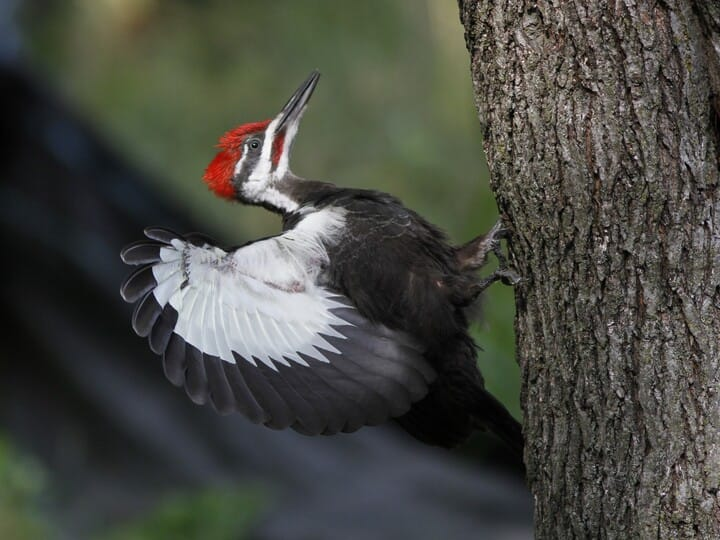

<left>

# Pileated Woodpecker (*Dryocopus pileatus*)

 

\::::: {style = "display: flex; gap: 10px;"}

::: {style="flex: 47.5%;"}

  
<small>Photo from <a href="https://www.allaboutbirds.org/guide/Pileated_Woodpecker/id" style="color: white !important;" target="_blank">All About Birds</a></small>

:::

::: {style="flex: 5%;"}
:::

::: {style="flex: 47.5%;"}
## **CONSERVATION STATUS**

- <abbr title="Committee on the Status of Endangered Wildlife in Canada">COSEWIC</abbr> Status: None

- <abbr title="Alberta's Endangered Species Conservation Committee">ESCC</abbr> Status in Alberta: None

- <abbr title="Government of Alberta's general status of wildlife species">General</abbr> Status in Alberta: Sensitive

* <abbr title="Alberta Conservation Information Management System">ACIMS</abbr> Status in  Alberta: [<u>S4</u>](https://www.alberta.ca/acims-conservation-status-ranks#jumplinks-1) 

* [<u>Link to **ABMI Status** Page</u>](https://abmi.ca/species/pileated-woodpecker)
:::

\:::::

 

## Overview

As primary cavity excavators, Pileated Woodpeckers (PIWO) serve as a critical keystone species in boreal and temperate forests. Their large cavities provide irreplaceable nesting and roosting habitat for at least 38 secondary cavity-using species of birds and mammals. The development of these 'cavity webs' is critically important to the maintenance of forest biodiversity. 

Under Canada's modernized Migratory Birds Regulations, 2022 under the Migratory Birds Convention Act, nest cavities of Schedule 1 protected species -- including the Pileated Woodpecker -- receive year-round protection against damage, destruction, or disturbance. Once a PIWO cavity is located, it cannot be altered or removed during industrial activities until it remains unoccupied by migratory birds for a mandatory wait period of 36 consecutive months. Consequently, industries, such as oil and gas, need tools to locate, evaluate, and monitor cavity-bearing trees prior to ground disturbance. 

As part of the effort to understand space use by PIWO and secondary cavity nesters, and better predict potential cavity locations, the Alberta Biodiversity Conservation Program is actively conducting research using autonomous recording units (ARU). The objectives of the research are to: 

1. Build probability-based acoustic signal decay models to estimate the exact distance and direction to a nest cavity directly from ARU sound files, drastically cutting down manual ground-search hours 

2. Integrate vocal signatures of secondary cavity nesters (e.g., waterfowl, owls, songbirds) into an auditory species classifier (HawkEars, https://abmi.ca/publication/656.html) to better understand acoustic signatures of secondary cavity nesters 

3. In collaboration with the Royal Alberta Museum, monitor cavities over a 3- to 5-year window to model cavity longevity, structural decay rates, and community-wide reuse patterns

4. Test ways to verify cavity occupancy from ground deployments of cavity inspection cameras, eliminating the safety hazards, technical equipment, and training costs associated with canopy tree climbing 

