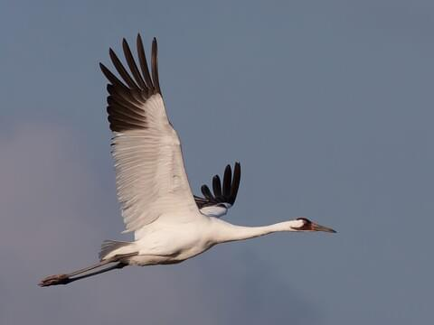

<left>

# Whooping Crane (*Grus americana*)

 

\::::: {style = "display: flex; gap: 10px;"}

::: {style="flex: 47.5%;"}

  
<small>Photo from <a href="https://www.allaboutbirds.org/guide/Whooping_Crane/id" style="color: white !important;" target="_blank">All About Birds</a></small>

:::

::: {style="flex: 5%;"}
:::

::: {style="flex: 47.5%;"}
## **CONSERVATION STATUS**

- <abbr title="Committee on the Status of Endangered Wildlife in Canada">COSEWIC</abbr> Status: Endangered

- <abbr title="Alberta's Endangered Species Conservation Committee">ESCC</abbr> Status in Alberta: Endangered

- <abbr title="Government of Alberta's general status of wildlife species">General</abbr> Status in Alberta: At Risk

* <abbr title="Alberta Conservation Information Management System">ACIMS</abbr> Status in  Alberta: [<u>S1</u>](https://www.alberta.ca/acims-conservation-status-ranks#jumplinks-1) 
:::

\:::::

 

## Overview 

## Overview 

The whooping crane (Grus americana) is an iconic endangered species endemic to North America, and the only remaining wild, self-sustaining population is the Aransas-Wood Buffalo population (AWBP). This population nests exclusively in and around Wood Buffalo National Park (WBNP) in northern Alberta and adjacent Northwest Territories, Canada, and winters at the Aransas National Wildlife Refuge on the gulf coast of Texas, USA (Urbanek and Lewis 2020). From a low point of 12–16 individuals in 1942, the AWBP has undergone modest but steady increases in size over the past 60 years, and recovery of the species depends on continued growth of this critical population (Pearse et al. 2015, Pearse et al. 2024) Protecting habitat at breeding and non-breeding sites, and mitigating risks to individual birds from potential hazards, have been identified as critical aspects of whooping crane conservation (Canadian Wildlife Service and U.S. Fish and Wildlife Service 2007). 

Cranes in the AWBP undertake a 4,000-km migration twice annually between their wintering grounds in Texas and their breeding grounds in Canada. The location of the breeding grounds causes cranes to pass directly through the Alberta Oil Sands Region (OSR) during migration. Because of the extensive industrial development for oil and other natural resources, migratory stopovers along this portion of the route can potentially cause unintended conflicts between humans and cranes. Research shows that, in a given year, 67% of migrating Whooping Cranes will stop at least once in the OSR, and 27% will stop at least once in the surface mineable area around Fort McMurray and Fort McKay. 

Several factors combine to increase whooping crane exposure to risks from oil sands infrastructure, with the main one being strong fidelity to the migration corridor center line despite extensive development along certain portions of it. Within the OSR, cranes face risks from potential collision with power lines (a major cause of mortality, Stehn and Wassenich 2008, Stehn and Haralson-Strobel 2016) and energy infrastructure, loss of available wetland habitat from mining and drilling activities (Volik et al. 2020), and from exposure to contaminants in wetlands near energy sector activities (Gleason et al. 2011, Connor et al. 2024). Analyses of GPS location data from migrating cranes suggests they tend to avoid sites with high amounts of human activity. Nevertheless, observations of cranes using locations in close proximity to oil sands mines and other infrastructure are not uncommon. 

Whooping cranes use a variety of wetland types within the boreal forest; especially shallow, open water ponds associated with marshes and fens (Timoney 1999). Wetlands constitute ~45% of the OSR and are at risk of degradation from anthropogenic activities (Ficken et al. 2019) and contamination by oil sands-derived compounds known to cause deleterious effects in birds (Mundy et al. 2019). The risks posed to individual cranes by proximity to anthropogenic features such as potentially contaminated wetlands, industrial sites, and electrical transmission lines during migration can scale up to create negative population-level consequences. 

In response to these known risks, Environment and Climate Change Canada and Parks Canada are actively conducting research aimed at understanding space use and migratory habitat selection by Whooping Cranes while transitiing through the OSR. 

## References 

Canadian Wildlife Service and U.S. Fish and Wildlife Service. 2007. International recovery plan for the whooping crane. Ottawa: Recovery of Nationally Endangered Wildlife (RENEW), and U.S. Fish and Wildlife Service, Albuquerque, New Mexico, Ottawa, Ontario, Canada. 

Connor, S. J., J. R. Hanisch, and D. Cobbaert. 2024. Wetland water quality in the Athabasca Oil Sands Region and its relationship to aquatic invertebrate communities: pilot phase monitoring results. Wetlands Ecology and Management 32:637–652. 

Ficken, C. D., D. Cobbaert, and R. C. Rooney. 2019. Low extent but high impact of human land use on wetland flora across the boreal oil sands region. Science of The Total Environment 693:133647. 

Gleason, R., T. Chesley-Preston, T. M. Prest, B. Smith, B. Tangen, and J. N. Thamke. 2011. Examination of brine contamination risk to aquatic resources from petroleum development in the Williston Basin. Fact Sheet. 

Mundy, L. J., K. L. Williams, S. Chiu, B. D. Pauli, and D. Crump. 2019. Extracts of passive samplers deployed in variably contaminated wetlands in the athabasca oil sands region elicit biochemical and transcriptomic effects in avian hepatocytes. Environmental Science & Technology 53:9192–9202. 

Pearse, A. T., D. A. Brandt, W. C. Harrell, K. L. Metzger, D. M. Baasch, and T. J. Hefley. 2015. Whooping crane stopover site use intensity within the Great Plains. Page 12. U.S. Geological Survey Open-File Report 2015-1166. 

Pearse, A. T., A. J. Caven, D. M. Baasch, M. T. Bidwell, J. A. Conkin, and D. A. Brandt. 2024. Flexible migration and habitat use strategies of an endangered waterbird during hydrological drought. Conservation Science and Practice 6:e13120. 

Stehn, T., and C. Haralson-Strobel. 2016. An Update on Mortality of Fledged Whooping Cranes in the Aransas/Wood Buffalo Population. Proceedings of the North American Crane Workshop.
Stehn, T., and T. Wassenich. 2008. Whooping Crane Collisions with Power Lines: An Issue Paper. Proceedings of the North American Crane Workshop. 

Timoney, K. 1999. The habitat of nesting whooping cranes. Biological Conservation 89:189–197.
Urbanek, R. P., and J. C. Lewis. 2020. Whooping Crane (Grus americana), version 1.0. Birds of the World. 

Volik, O., M. Elmes, R. Petrone, E. Kessel, A. Green, D. Cobbaert, and J. Price. 2020. Wetlands in the Athabasca Oil Sands Region: the nexus between wetland hydrological function and resource extraction. Environmental Reviews 28:246–261.
