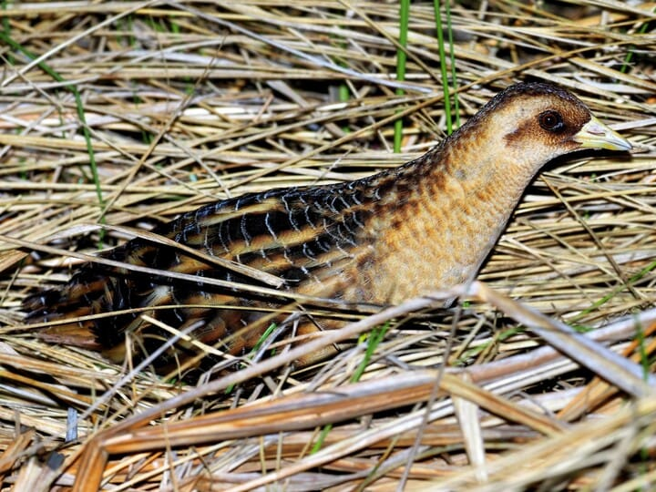

<left>

# Yellow Rail (*Coturnicops noveboracensis*)

 

\::::: {style = "display: flex; gap: 10px;"}

::: {style="flex: 47.5%;"}

  
<small>Photo from <a href="https://www.allaboutbirds.org/guide/Yellow_Rail/id" style="color: white !important;" target="_blank">All About Birds</a></small>

:::

::: {style="flex: 5%;"}
:::

::: {style="flex: 47.5%;"}
## **CONSERVATION STATUS**

- <abbr title="Committee on the Status of Endangered Wildlife in Canada">COSEWIC</abbr> Status: Special Concern

- <abbr title="Alberta's Endangered Species Conservation Committee">ESCC</abbr> Status in Alberta: None

- <abbr title="Government of Alberta's general status of wildlife species">General</abbr> Status in Alberta: Undetermined

* <abbr title="Alberta Conservation Information Management System">ACIMS</abbr> Status in  Alberta: [<u>SUB</u>](https://www.alberta.ca/acims-conservation-status-ranks#jumplinks-1) 

* [<u>Link to **ABMI Status** Page</u>](https://abmi.ca/species/yellow-rail)
:::

\:::::

 

## Overview 

Yellow Rails are secretive wetland birds that are listed as a species of Special Concern under Schedule 1 of the Species at Risk Act (SARA; COSEWIC 2023; Hedley et al. 2020). Canada accounts for about 90% of the species’ global breeding range (COSEWIC 2023), where it occupies shallow-water wetlands dominated by graminoids such as sedges or rushes (Bookhout and Stenzel 1987; Austin and Buhl 2013; Leston and Bookhout 2015; COSEWIC 2023). In the oil sands region of Alberta, surface mining leases abut or overlap important Yellow Rail habitat, including the McClelland Lake fen complex which is considered the most significant known Yellow Rail habitat in the region (Hedley et al. 2020). Ongoing habitat loss combined with projected climate change impacts, such as more frequent and prolonged droughts, may pose increasing risks to Yellow Rail habitat and populations (COSEWIC 2023).  

Much about the Yellow Rail’s biology and ecology remains poorly understood. Because the species occupies remote wetland habitats and vocalizes mainly at night, it is seldom detected in standardized biodiversity monitoring programs, which typically rely on road-based surveys conducted in the morning (Hedley et al. 2020; McLeod et al. 2021; COSEWIC 2023). They also have notoriously low site fidelity between years, which has limited the use of tracking devices and banding data to estimate survival, longevity and population trends (COSEWIC 2023). Concern about ongoing habitat loss, combined with the likelihood that population declines could go undetected, has contributed to its species at risk listing (COSEWIC 2023). 

Development in the oil sands region of Alberta poses both direct and indirect threats to Yellow Rail. Surface mining results in the direct loss of wetland habitat within the mine footprint, and it remains unknown whether reclaimed wetlands will provide suitable habitat for Yellow Rail (Hedley et al. 2020; COSEWIC 2023). In addition, mining can alter the hydrology of surrounding wetlands, extending its impact beyond lease boundaries (Hedley et al. 2020; COSEWIC 2023). Yellow Rail occupancy and abundance at individual wetlands can fluctuate from year to year, presumably in response to changing water levels (COSEWIC 2023). Because breeding habitat requires shallow standing water, even small hydrological changes could reduce habitat suitability for Yellow Rail by altering water depth and vegetation composition (Hedley et al. 2020; COSEWIC 2023). 

In response to these unknowns, the Alberta Biodiversity Conservation Program has proposed research to understand how wetlands used by Yellow Rails in the OSR might change from year to year, as well as over time. These changes will be affected by climate change, oil sands development, and reclamation activities. These changes will impact Yellow Rail population size and distribution in the OSR, as well as populations of other wetland-dependent species. 

## References 

Austin, Jane E., and Deborah A. Buhl. 2013. “Relating Yellow Rail ( Coturnicops Noveboracensis ) Occupancy to Habitat and Landscape Features in the Context of Fire.” Waterbirds 36 (2): 199–213. https://doi.org/10.1675/063.036.0209. 

Bookhout, Theodore A., and Jeffrey R. Stenzel. 1987. “Habitat and Movements of Breeding Yellow Rails.” Wilson Bulletin, 441–47. 

COSEWIC. 2023. Assessment and Status Report on the Yellow Rail, Coturnicops Noveboracensis, in Canada. Committee on the Status of Endangered Wildlife in Canada = Comité sur la situation des espèces en péril au Canada. 

Hedley, Richard W., Logan J. T. McLeod, Daniel A. Yip, et al. 2020. “Modeling the Occurrence of the Yellow Rail (Coturnicops Noveboracensis) in the Context of Ongoing Resource Development in the Oil Sands Region of Alberta.” Avian Conservation and Ecology 15 (1): art10. https://doi.org/10.5751/ACE-01538-150110. 

Leston, L., and T. A. Bookhout. 2015. “Yellow Rail (Coturnicops Noveboracensis).” In The Birds of North American Online. Version 2.0. Cornell Lab of Ornithology. https://doi.org/10.2173/bna.139. 

McLeod, Logan J. T., Samuel Haché, Rhiannon F. Pankratz, and Erin M. Bayne. 2021. “High-Density Yellow Rail (Coturnicops Noveboracensis) Population Beyond Purported Range Limits in the Northwest Territories, Canada.” Waterbirds 44 (2). https://doi.org/10.1675/063.044.0204.

