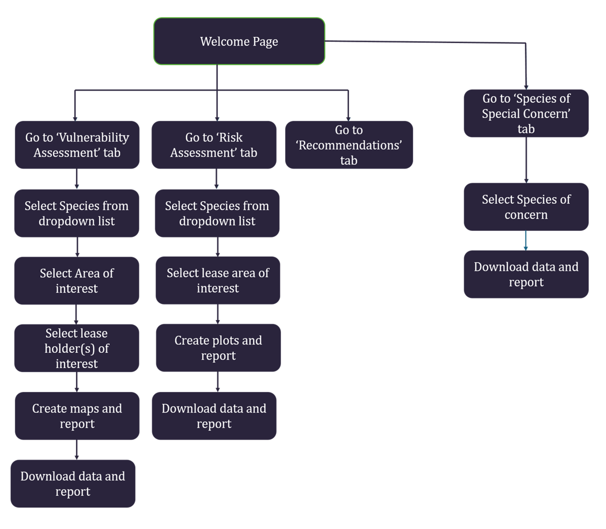

<left>

# Understanding species vulnerability and risks to wildlife populations in the Alberta Oil Sands Region 

</left>

 

## Overview

The OSR Biodiversity Assessment tool is a Shiny application for exploring species' vulnerability to oil sands disturbances within the context of natural disturbances (fire, insects, disease), other human-caused disturbances (e.g., forestry), and climate change. 

  

Vulnerability is assessed in terms of population-level exposure to oil sands disturbances, sensitivity to those disturbances, and risk of population loss relative to potential population outcomes without oil sands development. The effects of oil sands disturbances are estimated within the context of other natural and anthropogenic disturbance processes. These cumulative effects are taken into account though stochastic landscape simulation modelling, where uncertainty in outcomes is accounted for through estimating probabilities of a range of population outcomes. 

  

There are three distinct components of the OSR Biodiversity Assessment Tool: 

**1. Vulnerability:** Quantification of the population-level spatial exposure to oil sands disturbance for the selected species, including for current oil sands lease areas, and a brief review of known or inferred responses to typical oil sands disturbances. This includes sensitivity factors of habitat loss, edge avoidance, response to small canopy gaps, and potential fragmentation effects. 

**2. Risk Assessment:** If available, model-based estimates of the probability (i.e. *Risk*) of specific levels of population loss under different scenarios of oil sands development and assumptions about other disturbance and succession processes. 

**3. Recommendations:** Recommendations for mitigating risks to species populations based on known sensitivities and risk levels, based on the mitigation hierarchy (Avoid, Minimize, Remediate, Offset) 

**4. Species of Special Concern:** Some species that are already known to have unique needs or that are especially at risk may not fit well into the general framework outlined above. For these we outline what is known and highlight ongoing research meant to address important gaps in our knowledge. 

## Biodiversity Assessment Tool workflow diagram 

{width=100%}

